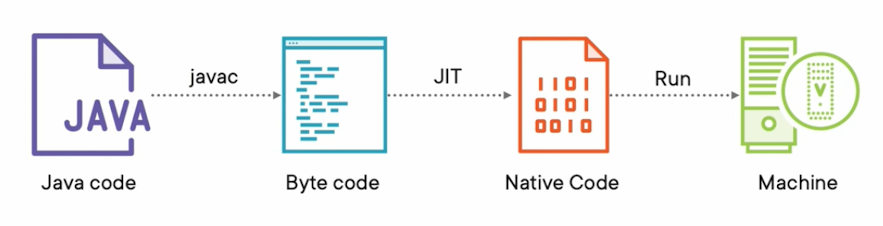
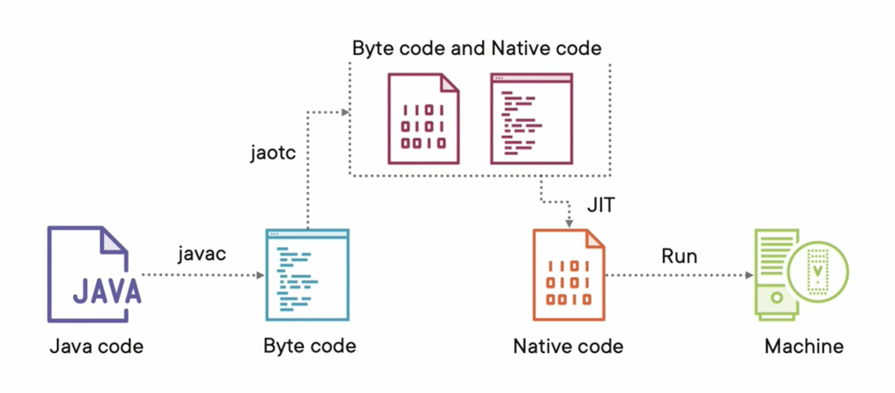

<h3 align="center">Estate-Guru</h3>

<div align="center">

  []() 
  [](/LICENSE)

</div>

---
### Biography  

**Authors:**  
Victor Puiu [[Github](https://github.com/victorpuiu "Github Page"), [Linkedin](https://www.linkedin.com/in/danut-victor-puiu-a007b354
"Linkedin Page")]  
  
**Date of initial commit:** 15/02/2023

---

## 📝 Table of Contents
- [Application](#application)
- [Set-Up](#setup)
- [Notes](#notes)
- [Stack](#stack)
- [References](#references)

## Application <a name = "application"></a>

**Description:**  
A simple Real-estate website GUI made in React and tailwind CSS. This will provide as the foundation for solidity and spring experiments. The backend is a fully reactive microservice using an R2DB connection with postgres and implementing Webflux capabilities.

**Endpoints**
```text
Created Route: GET markets/{marketId}/categories -> CategoryController#getAllCategories ()
Created Route: POST markets/{marketId}/categories/saveOrEdit/ -> CategoryController#createCategory ()
Created Route: DELETE markets/{marketId}/categories/{id} -> CategoryController#deleteCategory ()
Created Route: GET markets -> MarketController#getAllMarkets ()
Created Route: POST markets/saveOrEdit -> MarketController#createMarket ()
```

## Set-Up <a name = "setup"></a>

1. Install the latest version of SDKMAN! [sdkman](https://sdkman.io/install)
2. Install Java version `sdk install java  22.0.0.2.r17-grl` from SDKMAN.
3. When using IntelliJ IDE:
   1. Setup IDE config to gradle jdk 17-grl -> preferences -> build, execution, and deployment -> build tools -> Maven -> JDK
   2. Set project structure to jdk 17-grl
4. CD to `frontend` project folder and run `./npm run start` to build the frontend.
5. CD to the `backend` folder and run the project.

## Notes <a name = "notes"></a>

### Pros and Cons
* Large and active community, with strong support and resources available for debugging.
* Quarkus does not have support for Groovy, but it is faster than Micronaut.
* Security is an out-of-the-box feature in Spring Boot, making it easy to implement secure applications.
* Micronaut requires a different way of working, but it can increase development productivity and reduce production time.

### Spring  Vs. Micronaut
Spring Framework heavily depends on annotations, which generates reflective metadata for each and every bean before carrying out dependency injection. The downsides with Springs are:



Heavily depends on annotations, which creates generates reflective metadata for each and every bean before carrying out dependecy injection. Therefore, all that runtime information will be stored in a reflective cache. Hence, the memory usage will be significantly higher.

Spring uses JIT (=Just in time) compilation, meaning that java code is compiled to bytecode. Bytecode itself cannot be run on a machine, so we need a JVM to compile it to native code. JIT only compiles the byte code it needs in order to execute certain tasks. But in order to run the application needs its reflective caches which also need to be compiled to native code. Like stated above, The reflective caches are used so the JIT compilation time is huge, resulting in a slow start-up time.



Micronaut uses AOT (Ahead Of Time Compilation) which means that bytecode is compiled to native code where possible. resulting in a hybride code of byte code and native code. This code has less of an impact for the JIT compiler to compile the remaining byte code.
It provides the goodness of Spring, but reflection-free as much as possible

### Nassau Framework
Nassau Framework
If you are using Micronaut, Spring Security, which is commonly used with Spring Boot applications, may not be compatible due to its reliance on Spring's reflective beans. In this case, you may want to consider using Nassau Framework, which is a lightweight framework that is compatible with Micronaut.

Overall, Micronaut is a great choice if you need a lightweight and fast framework with low memory usage and fast startup times, and are willing to sacrifice some ease of use and community support. Spring Framework, on the other hand, is a mature framework with a huge community and a lot of resources available, making it a great choice for large and complex applications that require robust security features and extensive community support.


## ⛏️ Stack <a name = "stack"></a>
- [Spring Framework](https://spring.io/) - Spring framework
- [Liquibase](https://www.liquibase.org/) - Database migration tool
- [WebFlux](https://projectreactor.io/docs/core/release/reference/index.html) - Reactive web framework
- [R2DBC](https://r2dbc.io/) - Reactive database client
- [Git](https://git-scm.com/) - Version Control
- [React](https://reactjs.org/) - Frontend Framework

## ✍️ References <a name = "references"></a>
* Troubleshooting: <https://stackoverflow.com/>
* Spring Boot: <https://spring.io/projects/spring-boot>
* React course (Brad Traversy): <https://www.youtube.com/watch?v=w7ejDZ8SWv8>
* Git Ignore generator:<https://www.toptal.com/developers/gitignore>
* Reactive DB Micronaut: <https://medium.com/javarevisited/reactive-database-access-with-r2dbc-micronaut-and-graalvm-ee9b5853260>
* Unsplash (image Resource): <https://unsplash.com/>


